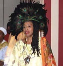
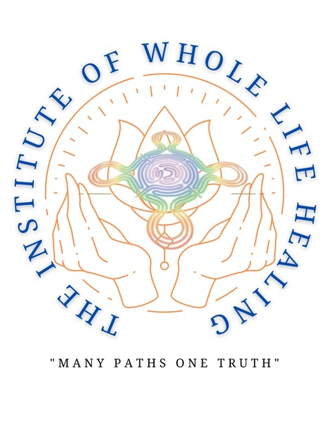
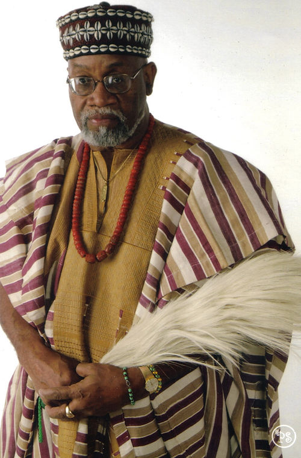

<html lang="en">
  <head>
    <meta name="viewport" content="width=device-width,initial-scale=1">
    <meta charset="utf-8">
    <meta name="generator" content="SwamiGInstitute.com 70-888-Swami)">
    <meta name="dcterms.created" content="Sun, 07 Sep 2025 21:43:41 GMT">
    <meta name="description" content="SwamiG Institute 70-888-Swami Orisha Ilekes Warriors Hand of Ifa Priesthood  initiations Divinaiton 4 cowrie Shango Heru Auset Oshun Sekert Olokun Het Heru Yemojah Obarala Ausar Amen  prayer sacrifice">
    <meta name="keywords" content="Orisha,Ilekes,Warriors, Hand of Ifa, Priesthood ,initiations,Divinaiton,4 cowrie,Shango,Heru,Auset,Oshun,Sekert,Olokun,Het Heru,Yemojah,Obarala,Ausar,Amen,prayer,sacrifice">
    <title>SwamiG Institute Lineage</title>

    
SwamiG Institute 2025

    

    
Extending Royal Legacy

    
<h3>"...on the shoulders of enlightened ancestors..."</h3>

	 
	 
	 
	 
	 
	
    
  </head>
  <body>

  <table>
    <tr>
      <td>
          
        Awise Wande Abimbola & Iya Besie Abimbola - Nigeria West Africa 
        Iya Omoladun Anke - Nigeria West Africa 
        Baba Ogunyeye Akangbe - Nigeria, West Africa 
        Iya Osunnike Anke - US   
        <b>HRM Queen Mother Osunnike Ifeyinwa Anke Eri</b>
      </td>
      <td>
        
		 
        <b>...we seek no followers...</b>
      </td>
      <td>
         
        Yaagbe Orisa Keye Agbede - Nigeria West Africa 
        Chief Araba Malomo - Nigeria West Africa 
        Baba Oloye Ifa Karade - US 
        Baba Koleoso Karade - US   
        <b>HRH Nwa Chukwu Eri Nashid Koleoso Karade</b>
      </td>
    </tr>

    <tr>
      <td></td>
      <td>1- Know Thyself, Ilekes (Heru)</td>
      <td></td>
    </tr>

    <tr>
      <td></td>
      <td>2- Cleanse & Purify, Warriors (Herukhuti)</td>
      <td></td>
    </tr>

    <tr>
      <td></td>
      <td>3- Living in Alignment With Absolute Truth (Ausar)</td>
      <td></td>
    </tr>
  </table>

 

SwamiG Institute Lineage

 

<table width="100%" border="1" cellpadding="2" cellspacing="2" style="background-color: #ffff00;">
<tr valign="top">

<td style="border-width : 0px;"> 
</td>

<td style="border-width : 0px;"> 
</td>

<td style="border-width : 0px;"> 
</td>
<td style="border-width : 0px;"> </td>
<td style="border-width : 0px;"> </td>
<td style="border-width : 0px;"> </td>
<td style="border-width : 0px;"> </td>

<td style="border-width : 0px;"> 
 

4)	Infinite Wisdom  <u>Ilekes</u> (Tehuti)  
5)	Speaking words of power  <u>Warriors</u> (Sekert)  
6)	Transformational Devotion <u>Hand of Ifa</u> (Auset)  
 
 
 
<b>Extending Royal Legacy</b>
 
...on the shoulders of enlightened ancestors...

</td>
<td style="border-width : 0px;"> 
</tr>
<tr valign="top">
<td style="border-width : 0px;"> 
</td>
<td style="border-width : 0px;"> 
</td>
<td style="border-width : 0px;"> 
</td>
<td style="border-width : 0px;"> 
</td>
<td style="border-width : 0px;"> 
</td>
</tr>
