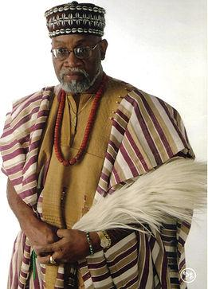
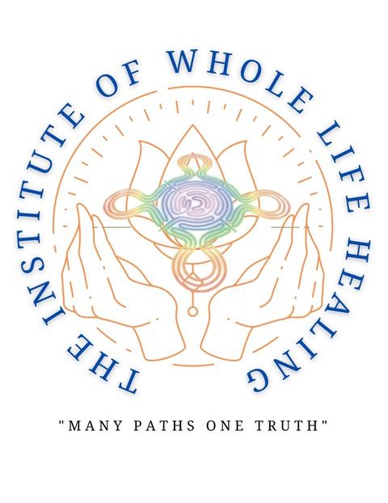
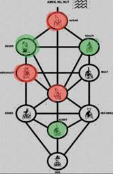

<!DOCTYPE html>
<html lang="en">
<head>
  <meta charset="utf-8" />
  <meta name="viewport" content="width=device-width, initial-scale=1" />
  <title>SwamiG Institute — Anke–Karade Lineage | Extending Royal Legacy</title>
  <meta name="description" content="Anke–Karade lineage overview for SwamiG Institute. Extending Royal Legacy — on the shoulders of enlightened ancestors." />

  <!-- SEO / Social -->
  <meta property="og:title" content="SwamiG Institute — Anke–Karade Lineage" />
  <meta property="og:description" content="Extending Royal Legacy — on the shoulders of enlightened ancestors." />
  <meta property="og:type" content="website" />
  <meta property="og:url" content="https://swamiginstitute.github.io/" />
  <meta property="og:image" content="image010.jpg" />
  <meta name="twitter:card" content="summary_large_image" />

  <!-- Fonts -->
  <link rel="preconnect" href="https://fonts.googleapis.com" />
  <link rel="preconnect" href="https://fonts.gstatic.com" crossorigin />
  <link href="https://fonts.googleapis.com/css2?family=Inter:wght@300;400;600;800&family=Crimson+Text:wght@400;700&display=swap" rel="stylesheet" />

  
</head>

<body>
  <header class="wrap">
    
    <h1>SwamiG Institute • Extending Royal Legacy</h1>
    
“…on the shoulders of enlightened ancestors”

    
Anke–Karade Lineage

  </header>

  <main class="wrap">
    

      

        
        
<h3>HRM Queen Mother Osunnike Ifeyinwa Anke Eri</h3>
Nigeria / US

      

      

        
        
<h3>Priest King Nwachukwu Eri Nashid Koleoso Karade</h3>
United States

      

      

        
        
<h3>Awise Wande Abimbola &amp; Iya Besie Abimbola</h3>
Nigeria, West Africa

      

      

        
        
<h3>Yaagbe Orisa Keye Agbede</h3>
Nigeria, West Africa

      

      

        
        
<h3>Iya Omoladun Anke</h3>
Nigeria, West Africa

      

      

        
        
<h3>Baba Ogunyeye Akangbe</h3>
Nigeria, West Africa

      

      

        
        
<h3>Baba Oloye Ifa Karade</h3>
United States

      

      

        
        
<h3>Awo Fasuuruate Anke-Karade (“SwamiG”)</h3>
United States

      

      

        
        
<h3>Extending a Legacy</h3>
Symbolic illustration

      

      

        
        
<h3>Archival Lineage</h3>
Legacy document

      

      

        
        
<h3>Lineage Illustration</h3>
Legacy visual

      

    

    <section class="pillars">
      
1) Infinite Wisdom (Tehuti) — Ìlekes

      
2) Speaking Words of Power (Sekert) — Warriors

      
3) Transformational Devotion (Auset) — Hand of Ifá

    </section>

    
“…Extending Royal Legacy…”

    
“…on the shoulders of enlightened ancestors…”

  </main>

  <footer>
    
SwamiG Institute — Extending Royal Legacy — On the shoulders of enlightened ancestors

    
<a href="http://swamiginstitute.com">SwamiGInstitute.com</a> | <a href="https://cash.app/$DrSwami">$DrSwami</a>

  </footer>
</body>
</html>
